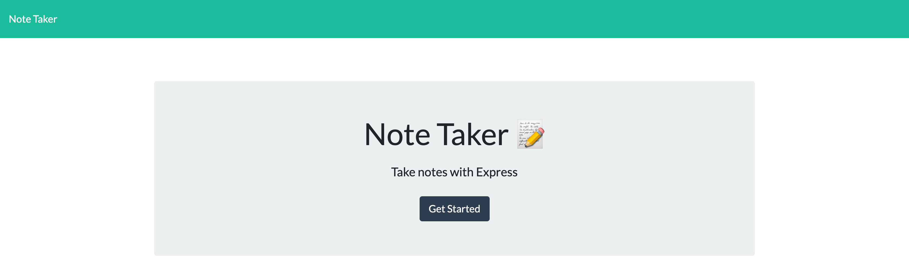

# Express.js-Note-Taker
### Motivation
Learn how to properly use express.js as a back end server
work with Heroku for the first time
#### ScreenShot

### Link
https://blueberry-pudding-33694.herokuapp.com/